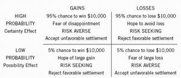
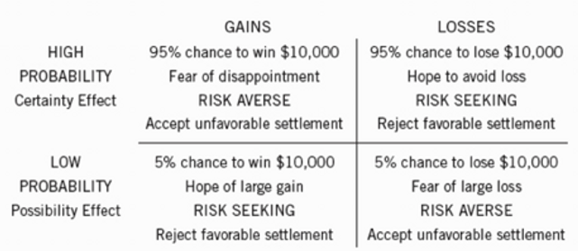

Nobel Ekonomi Ödüllü tek Psikolog Daniel Kahneman, ekonomi biliminin dayanağı olan "İnsan, rasyonel bir karar alıcıdır" algısını yerle bir eden ve aslında ne kadar irrasyonel ve duygularıyla karar alan canlılar olduğumuzu ortaya koyan bir bilim insanı.

Kahneman'ın Hızlı ve Yavaş Düşünme kitabı, davranışsal ekonomi ve insan beyni konusunda hem çok temel hem de hiçbir yerde karşılaşamayacağımız bilgilerle dolu bir kitap.

Ve bence farkındalıkla yaşamak isteyen herkesin okuması gereken bir kitap.

Ben kitabın can alıcı kısımlarını sizler için derledim. Ama eminim ki bu yazıyı okuduktan sonra dahasını merak edecek ve kitabı sipariş edeceksiniz.

Hadi başlayalım...

### **İki Sistem**

Kahneman, zihindeki iki sisteme vurgu yapar:

Birinci Sistem, otomatik olarak ve hızlı işler; çok az ve hatta sıfır çaba gerektirir ve hiçbir istemli denetim içermez.

İkinci Sistem dikkati, karmaşık hesaplamalar dahil, çaba isteyen zihinsel işlemlere yöneltir.

Sistem 2'nin işleyişi sıklıkla eylem, seçim ve yoğunlaşmaya ilişkin öznel deneyimlerle ilişkilendirilir.

Bu iki sistem insan beyninde bir arada bulunur ve birlikte çalışarak yaşamda yön bulmamıza yardımcı olur.

Sistem 1, durdurulamayan sezgisel bir sistemdir ve bu sisteme atfedilen otomatik etkinliklerin bazıları şunlardır;

- Bir nesnenin ötekinden uzakta olduğunu saptamak.
- Tehditleri hissetmek.
- Ani bir sesin kaynağına yönelmek.
- ''Tencere yuvarlanmış…'' cümlesini tamamlamak.
- 2+2=4 olduğunu bilmek.
- Büyük reklam panolarındaki sözcükleri okumak.
- Basit cümleleri anlamak.

Sistem 2, karmaşık problemleri analiz etmemize, matematik alıştırmaları yapmamıza, çapraz bulmacalar yapmamıza vb. yardımcı olur.

Sistem 2'nin çok farklı faaliyetlerinin tek bir ortak özelliği vardır: Dikkat gerektirir ve dikkat dağılınca aksar. Örneğin;

- Kalabalık ve gürültülü bir ortamda belli bir kişinin sesine odaklanmak.
- Topluluk içinde davranışınızın uygunluğunu denetlemek.
- Bir sayfalık metinde "a" harfinin kaç kere geçtiğini saymak.
- Birine telefon numaranızı vermek.
- Vergi beyannamesi doldurmak.
- Dar bir yere arabanızı park etmek.
- Karmaşık bir mantıksal savın geçerliliğini sınamak.

Sistem 2 faydalı olsa da, onu devreye sokmak için çaba ve enerji gerekir. Bu nedenle beynimiz, 1. Sistem'in emriyle kısayollar bulma eğilimindedir. Örneğin, tümevarım.

Bu yargı çoğu insan tarafından doğru olarak kabul edilir. Tabii ki değil. Kandırılırız çünkü sezgisel olarak güllerin solduğunu biliyoruz. Ancak bu kıyas dünya hakkında bir ifade değildir; mantıksal ilişkilerle ilgilidir.

2\. Sistem tarafından ifadeleri tam olarak analiz etmek için gereken enerji nispeten yüksektir; Sistem 1, sonucun doğru olduğu kararını verir ve diğer sistemi ikna eder.

Görünen o ki, insanlar yanlış bir ifadeye ilk kez inanmaya başladıklarında, onu destekleyen argümanlara inanma olasılıkları çok yüksektir; ve bu da doğrulama yanlılığının temelidir.

**Yani mevcut inançlarımızı doğrulayan bilgileri aramaya ve bu bilgilere daha kolay ikna olmaya meyilliyiz.** Politikada buna sıkça rastlanır.

Şimdi, Kahneman'ın tanımladığı büyük yanılgıların bir özetine bakalım:

### **Çağrışım Etkisi**

Zihinlerimiz, harika birer çağrışım makineleridir.

Bu nedenle, bizi belirli bir yöne veya eyleme yönlendirmek için çağrışımların zihnimize getirdiklerine duyarlıyız.

Bizi çağrışımların etkilediğini kolay kolay fark etmeyiz ancak zihinle ilgili yapılan deneylerde çağrışımların gücünü rahatlıkla görebiliriz.

Örneğin 'yemek' kelimesini gördükten veya duyduktan kısa bir süre sonra ''ço__'' kelimesindeki boşluğu çorap yerine çorba şeklinde doldurmaya daha meyilliyiz.

### **Bilişsel Kolaylık**

Sistem 2 için hangisi daha kolaysa ona inanılması daha olasıdır.

Kolaylık, fikirlerin tekrarlanmasından, net bir şekilde sergilenmesinden, hazır bir fikirden ve hatta kişinin kendi iyi ruh halinden kaynaklanır.

Kavram tanıdık hale geldiğinden ve bilişsel olarak işlenmesi kolay olduğundan, bir yalanın tekrarının bile, doğru olmadığını bilmesine rağmen, insanları onu kabul etmeye yönlendirebileceği ortaya konmuştur.

### **Sonuçlara Atlamak**

Birinci Sistem için başarının ölçütü, yaratmayı becerdiği öykünün tutarlılığıdır. Öykünün dayandığı verilerin, nicelik ve niteliğinin bununla ilgisi yoktur. Enformasyon kıt olduğundan, ki buna çok sık rastlanır, birinci sistem sonuçlara atlama makinesi gibi çalışır.

Sınırlı delillere dayanarak sonuçlara atlamak, sezgisel düşüncenin anlaşılması açısından çok önemli. Kahneman, bunun için GHNO kısaltmasını kullanır, yani ''**Gördüğün Neyse Hepsi Odur.''**

Birinci sistem izlenim ve sezgileri ortaya çıkaran enformasyonun hem niceliğine hem de niteliğine tamamen duyarsızdır.

Halo etkilerinin ölçülen etkisi, doğrulama yanlılığı, çerçeveleme etkileri ve temel oran ihmali, pratikte sonuçlara atlamanın yönleridir. Bunun iyi bir örneği, doğrulama yanlılığıdır; burada, inanmayanlardan ziyade inançlarımızı destekleyen kanıtlara daha açık oluruz.

Rasyonel olarak, inanç sistemimizi daha fazla incelemeye tabi tutacağından, inançlarla çelişen kanıtlar aramalıyız. Ancak saf bilimin zorlukları dışında, böyle bir yaklaşım nadir görünür.

### **Daha Kolay Bir Sorunun Yanıtlanması**

Zor bir soruya tatmin edici bir yanıt hemen bulunmazsa, birinci sistem konuyla ilgili daha kolay bir soru bulup yanıtlayacaktır.

Hedef soru, üretmeyi amaçladığınız değerlendirmedir.

Kısa yol sorusu, onun yerine yanıtladığınız daha basit sorudur.

Başka bir deyişle, bir buluşsal yöntem kullanıyoruz; örneğin "Bugünlerde hayattan ne kadar hoşnutsunuz?" diye sorulduğunda "Şu anki ruh halim nasıl?" sorusuna cevap vermeye meyilliyiz.

Kısa yolun (heuristic) teknik tanımı, zor sorulara yeterli, ama sıklıkla da kusurlu yanıtlar bulmamıza yardım eden basit bir prosedürdür. Sözcük, eureka(buldum!) ile aynı kökten gelir.

### **Küçük Sayılar Yasası**

Küçük örneklere aşırı bir inancımız var, ancak kalıplar ve açıklamalar arama eğilimimiz bizi yanlış veya desteklenemez tesadüfi olayların nedensel bir açıklamasına götürüyor.

Kahneman gibi araştırmacılar bile araştırmalarında örneklem büyüklüğünün yetersizliğinin kurbanı oluyorlar.

### **Çıpalar**

Çıpalama, zihni bir beklentiyle hazırlamanın bir biçimidir.

"En uzun sekoya ağacının yüksekliği x fitten fazla mı yoksa az mıdır?"

''En uzun sekoya ağacının yüksekliği hakkında en iyi tahmininiz nedir?''

x 1200 iken ikinci sorunun cevabı 844; x 180 olduğunda cevap 282 idi.

### **Bulunabilirlik**

Bulunabilirlik kısa yolu, olayların sıklığını ''benzer örneklerin akla gelme rahatlığı''na göre belirleme süreci olarak tanımlanıyor.

Bulunabilirlik de diğer yargı kısa yollar gibi bir soruyu başkasıyla ikame eder: bir kategorinin büyüklüğünü ya da bir olayın sıklığını değerlendirmek istersiniz, ama örneklerin aklınıza ne kadar kolay geldiğine dair bir izleminizi belirtirsiniz. Soruların birbirinin yerini alması, kaçınılmaz olarak sistematik yanlışlar üretir.

Kısa yolun yanlılıklara nasıl yol açtığını basit bir yöntemle keşfedebilirsiniz: Örneklerin ortaya çıkmasını kolaylaştıran, sıklık dışındaki faktörleri listeleyin. Listenizdeki her faktör potansiyel bir yanlılık kaynağı olacaktır.

Dramatik bir olay, ait olduğu kategorinin bulunabilirliğini geçici olarak arttırır.

Medyada geniş yer verilen bir uçak kazası, havayollarının güvenliğiyle ilgili düşüncelerinizi geçici olarak değiştirecektir.

Yol kenarında yanan bir araba gördükten sonra kazalar zihninizi bir süre meşgul eder ve dünyayı daha tehlikeli bir yer olarak görmeye başlarsınız.

### **Temsil Edilebilirlik**

Temsiliyet, olasılıkları yargılamamıza yardımcı olması için klişeleri kullandığımız yerdir.

Örneğin, metroda The New York Times okuyan birini gördünüz. Aşağıdakilerden hangisi bu yabancı hakkında daha iyi bir bahistir?

Temsiliyet, doktorası olduğu yönünde tahmin yürütmenizi ister, ama bu akıllıca bir tahmin değildir. İkinci alternatifi de ciddi olarak düşünmeniz gerekir, çünkü metrolarda yolculuk yapan üniversite mezunu olmayan kişiler, doktora derecesi olanlardan çok daha fazladır.

### **Az Çoktur**

Linda, 31 yaşında, bekar, açık sözlü ve çok zeki bir kadındır. Felsefe dalında eğitim görmüştür. Öğrenciyken, ayrımcılık ve sosyal adalet meseleleriyle derinden ilgilenmiş ve nükleer karşıtı gösterilere katılmıştır.

2\. Linda banka memurudur ve feminist harekette aktiftir.

Bu durumda, Linda'nın cevap 2'deki "feminist harekette aktif" olduğu ek ayrıntısı, daha fazla kısıtlama getirdiği için yalnızca olasılığı düşürmeye hizmet eder.

Ancak, eşlik eden anlatı nedeniyle, daha az olası olmasına rağmen ikinci seçeneği seviyoruz. Bu yüzden "Az Daha Çoktur".

Bu arada sadece Stanford ve Berkeley'de sosyal bilimler lisans üstü öğrencilerinin büyük çoğunluğu doğru yanıt veriyor; ''feminist banka veznedarı'' ''banka veznedarı''ndan daha az muhtemeldir.

### **Nedenler İstatistiğe Üstün Gelir**

Bazı araştırmacılar tarafından elde edilen bulgulara göre, insanlar zayıf istatistiksel akıl yürütücülerdir ve açıkça ilgili arka plan verileriyle sağlandığında bile Bayes terimleriyle düşünme yetenekleri sınırlıdır.

Bir taksi gece vakti birisini ezip kaçtı. Şehirde Yeşil ve Mavi adlı iki taksi şirketi faaliyet gösteriyor. Ve bize aşağıdaki veriler sunuluyor;

- Kentteki taksilerin %85'i yeşil, %15'i de mavi taksi şirketine ait.
- Bir görgü tanığı, taksiyi Mavi olarak teşhis etti. Mahkeme, tanığın güvenilirliğini kaza gecesinin koşulları altında sınadı ve renklerin her birini %80 oranında doğru teşhis ettiği, %20 oranında ise çuvalladığı sonucuna vardı.

Kazaya karışan taksinin Yeşil değil de Mavi olma olasılığı nedir?

Bu, standart bir Bayesçi çıkarım problemi.

Bilgi veren iki şık var: Biri temel oran, diğeriyse bir tanığın tam güvenilir olmayan ifadesi. Görgü tanığı olmadığında, suçlu taksinin Mavi olma olasılığı, o sonucun temel oranı olan %15'tir. Her iki taksi şirketi de aynı büyüklükte olsaydı, temel oranın bilgi değeri olmazdı, siz de sadece tanığın güvenirliğine bakıp olasılığın %80 olduğu sonucuna varırdınız. İki kaynak bilgi Bayes kuralıyla birleştirilebilir.

Ancak bu problemle karşılaşan kişilerin ne yaptıklarını tahmin etmek güç değil: Temel oranı göz ardı edip tanığın ifadesine göre karar veriyorlar.

### **Ortalamaya Doğru Regresyon**

Ortalamaya regresyon, herhangi bir deneme dizisinin sonunda beklenen değere (yani ortalamaya) yaklaşacağı istatistiksel gerçektir.

Ne yazık ki, şanslı çizgileri ve görünüşte anlamlı sayıların diğer dizilerini açıklamak için sıklıkla nedensel nedenler ararız.

Kahneman zihinsel eksiklikleri tarif etmeye devam ediyor, örneğin:

**Anlama yanılsaması:** Anlamaya ve dünyayı anlamlandırmaya yardımcı olmak için anlatılar kurarız. Hiçbirinin olmadığı yerde nedensellik ararız.

**Geçerlilik yanılsaması:** Kendi düşünce ve inançlarının doğruluğuna olan aşırı güven.

**Uzman sezgisi:** Disiplinle uygulanan algoritmalar, görünüşte ilkel olsalar bile çoğu zaman uzmanları geride bırakır.

**Planlama yanılgısı:** bu yanılgı birçok mesleği etkiler ve gerçekçi olmayan bir şekilde en iyi duruma yakın plan ve tahminlerden kaynaklanır.

**İyimserlik ve Girişimci Yanılgısı:** Çoğu insan kendine aşırı güvenir, rakiplerini ihmal etme eğilimindedir ve ortalamadan daha iyi performans göstereceklerine inanırlar.

### **Bağış Etkisi**

Çoğu insan, bağış etkisinin bir yönüne aşinadır, batık maliyet yanılgısı. Deneyim ve eğitimle, tüccarlar gibi insanlar batık maliyetin veya bağış etkisinin üstesinden gelebilir. Temel fark, malların ticaret için mi yoksa kullanım için mi elde tutulduğu gibi görünüyor. İkinci durumda, batık maliyet veya bağış etkileri daha büyüktür.

### **Kayıptan Kaçınma**

Bir şeyi kaybetme sonucunda oluşan mutsuzluğun, o şeye sahip olmanın getirdiği mutluluktan daha fazla olması sonucunda kayıptan kaçınmayı kazanca tercih etmektir.

Bu terim, irrasyonel risklerden kaçınmak ve piyasa anormalliklerini açıklamak için sıklıkla kullanılır.

### **İnsanlar Rasyonel Değildir**

İktisatta aktörlerin standart muamelesi rasyonaliteyi varsaymaktır. Ancak, insanların tamamen rasyonel olmadığı çoktan ortaya çıktı.

Genelde kesin şeyleri tercih ederler; Riskin ortadan kaldırılmasını, makul bir şekilde kabul edilebilir bir düzeye indirgemekten daha fazla değerlendirme eğilimine sahiptirler.

### **Dörtlü Model**

İnsanlar, varlıktan çok kayıp ve kazançlara değer verirler ve sonuçlara atfettikleri karar ağırlıkları olasılılardan farklıdır.

- Her bir hücredeki üst satır, aydınlatıcı beklentiyi gösteriyor.
- İkinci satır, beklentinin uyandırdığı odaktaki duyguyu tanımlıyor.
- Üçüncü satır, kumar ile onun beklenen değerine karşılık gelen kesin kazanç( ya da kayıp) arasında bir seçme şansı verildiğinden çoğu kişinin nasıl davrandığını belirtiyor. Eğer kesin şey tercih edildiyse, risk peşinde koşma denir.
- Dördüncü satır, bir sulh hukuk davasında çözüm üzerine tartışan bir davalı ile davacının beklenen tutumlarını tarif ediyor.

### **Son Deneyimlere Fazla Ağırlık Vermek**

İnsanlar son deneyimlere fazla ağırlık verme eğilimindedir ve birinin olumlu ya da olumsuz algısı, orantısız bir şekilde tüm deneyimin son bölümleri tarafından belirlenir.

Dolayısıyla kötü başlayan ama güzel biten bir tatilin olumlu hatırlanması muhtemeldir.

Hayata ve insana bakış açımı değiştiren, ön yargılarımı yıkmada büyük faydası olan ''Hızlı ve Yavaş Düşünme'' kitabının derlemesini burada bitiriyorum. Umarım faydası olmuştur.
