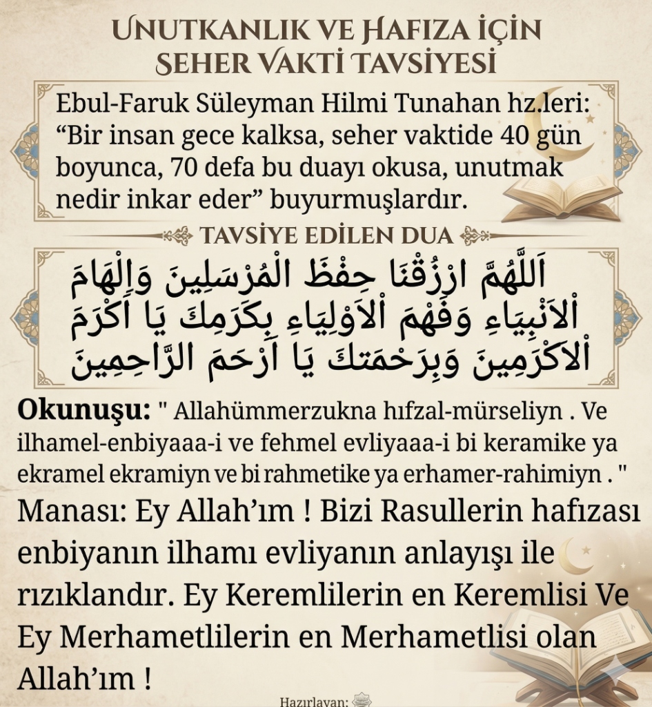

## Hazret Süleyman Hilmi Tunahan (k.s.)'dan Unutkanlık İçin Dua Tavsiyesi

> "Bir insan gece kalksa, seher vaktinde 40 gün boyunca, 70 defa bu duayı okusa, unutmak nedir inkâr eder."
>
> — **Süleyman Hilmi Tunahan (k.s.)**

---

### Tavsiye Edilen Dua

---

### Okunuşu

> **"Allahümmerzuknâ hıfzal-mürselîn. Ve ilhâmel-enbiyâ-i ve fehmel evliyâ-i bi kerâmike yâ ekramel ekramîn ve bi rahmetike yâ erhamer-rahimîn."**

---

### Anlamı

> Ey Allah'ım! Bizi Rasullerin hafızası, enbiyanın ilhamı, evliyanın anlayışı ile rızıklandır. Ey Keremlilerin en Keremlisi ve ey Merhametlilerin en Merhametlisi olan Allah'ım!

---

### Nasıl Okunmalı?

- **Zaman:** Seher vakti (gece kalkarak)
- **Süre:** 40 gün boyunca aralıksız
- **Tekrar:** Her gece **70 defa** okunmalı
